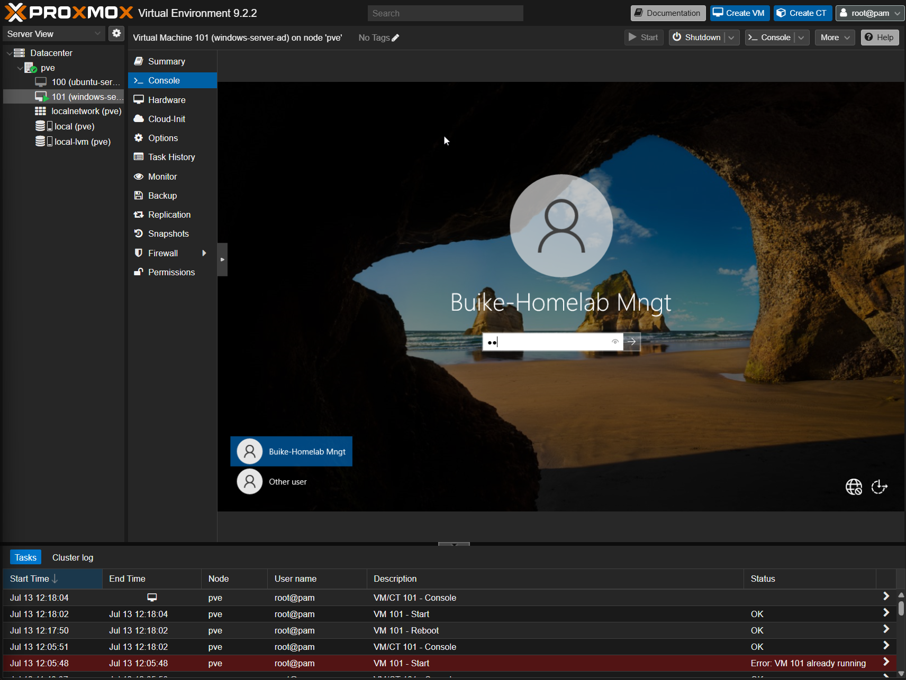
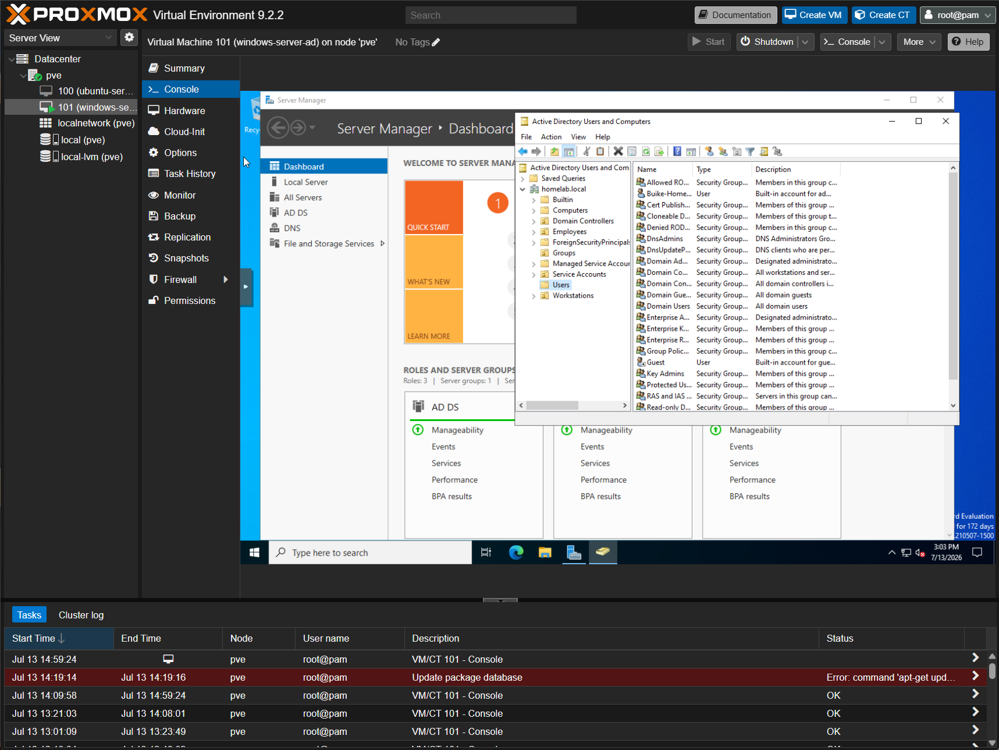

# Home Lab: Active Directory Domain Services

A Windows Server 2022 domain controller built inside my Proxmox home lab, standing up a working Active Directory forest (`homelab.local`). This project was built specifically to close a common gap for Sys Admin and Network Engineer job applications: hands-on AD experience, since most Windows-shop roles assume it even when the rest of a candidate's background is Linux-heavy. It also runs in parallel with my AZ-104 certification prep.

---

## Why a VM, not bare metal or a container

Active Directory requires Windows Server as the host OS, it cannot run in a container. Two options were on the table:

1. **Bare metal** — install Windows Server 2022 directly on dedicated hardware. Cleanest separation, but it sacrifices a physical machine entirely for one role.
2. **Virtualized on Proxmox** (chosen) — runs alongside the existing Linux services VM without disrupting it, mirrors how real virtualized enterprise environments are built, and supports snapshotting before any risky change.

---

## VM Specifications

| Setting | Value |
|---|---|
| VM ID | 101 |
| Name | windows-server-ad |
| Guest OS | Windows Server 2022 |
| EFI / TPM Storage | local-lvm |
| Disk | 60GB |
| CPU | 1 socket / 2 cores |
| RAM | 4096 MB |
| Network | Bridge vmbr0, VLAN 10, VirtIO NIC |
| Guest Agent | Enabled |

---

## Build Process

### 1. Resolving VirtIO Network Drivers

Stock Windows Server ISOs don't ship with VirtIO drivers, so the VM initially had no network connectivity after install. Fixed by:

1. Downloading the VirtIO driver ISO (`virtio-win.iso`) from the official Fedora project mirror
2. Attaching it to the VM's virtual CD/DVD drive via Proxmox
3. Running `virtio-win-guest-tools.exe` from within Windows to install the network, storage, and balloon drivers in a single pass
4. Rebooting and confirming the adapter enumerated correctly as a Red Hat VirtIO Ethernet Adapter with a valid DHCP lease

### 2. Static IP Assignment

Domain controllers should never run on DHCP. Configured a static IP through the legacy Control Panel network adapter settings:

| Setting | Value |
|---|---|
| IP address | 10.0.10.10 |
| Subnet mask | 255.255.255.0 |
| Default gateway | 10.0.10.1 |
| Preferred DNS | 10.0.10.10 (self, once AD DNS is live) |
| Alternate DNS | 8.8.8.8 (temporary fallback) |

### 3. Hostname

Renamed from the Windows default (`WIN-XXXXXXX`) to **DC01** via Server Manager, followed by a restart to apply.

### 4. Installing the AD DS Role

Standard Server Manager role installation flow: Add Roles and Features → Active Directory Domain Services → accept the associated RSAT/management tools → Install.

### 5. Promoting to Domain Controller

| Configuration choice | Value |
|---|---|
| Deployment type | New forest |
| Root domain name | homelab.local |
| Forest/domain functional level | Default |
| DNS Server / Global Catalog | Enabled (default) |
| DSRM password | Set separately from the Administrator account, stored securely for disaster recovery only |
| NetBIOS name | Auto-generated (HOMELAB) |

A DNS delegation warning appeared during promotion, expected behavior for a standalone lab forest with no real parent DNS zone to delegate from; it does not indicate a misconfiguration.

The server reboots automatically once promotion completes.

---

## Verification

Confirmed the domain was live and functioning through three checks:

1. Login screen reflected the domain-qualified account (`HOMELAB\Administrator`)
2. **Active Directory Users and Computers** showed `homelab.local` with DC01 correctly listed under the Domain Controllers OU
3. **DNS Manager** showed DC01 as an active DNS server with a forward lookup zone for `homelab.local`

*Domain-joined login screen for DC01, confirming the account is recognized at the domain level rather than as a local-only login.*

*ADUC view of the `homelab.local` domain, showing the built-in Users container, security groups, and the Workstations OU alongside the custom OU structure.*

---

## Organizational Unit Design

Rather than leaving objects in the default Users/Computers containers, I structured a proper OU hierarchy:

| OU | Purpose |
|---|---|
| Employees | User accounts |
| Workstations | Domain-joined client machines |
| Groups | Security groups |
| Service Accounts | Kept separate from human user accounts, standard security practice |

A test user (`tuser`) and a security group were created within this structure to validate OU design and group membership.

---

## What This Demonstrates

- Understanding of AD DS architecture: forests, domains, DNS integration, and the authentication/authorization model behind Kerberos and NTLM
- Ability to troubleshoot hypervisor/guest driver issues independently
- Correct handling of DC-specific requirements (static IP, self-referential DNS, DSRM password) rather than following a generic Windows Server setup
- OU and security group design aligned with real-world best practices, not just default containers

---

## Roadmap

- Join a Windows 10/11 client VM to `homelab.local` and validate domain login
- Build and apply a Group Policy Object (GPO) to the joined client
- Implement 802.1X network authentication via the NPS role, tying into VLAN access control on the MikroTik router (see [network infrastructure documentation](./network-infrastructure-kb.md))
- Mirror this build conceptually in Azure AD as hands-on practice for the AZ-104 certification
